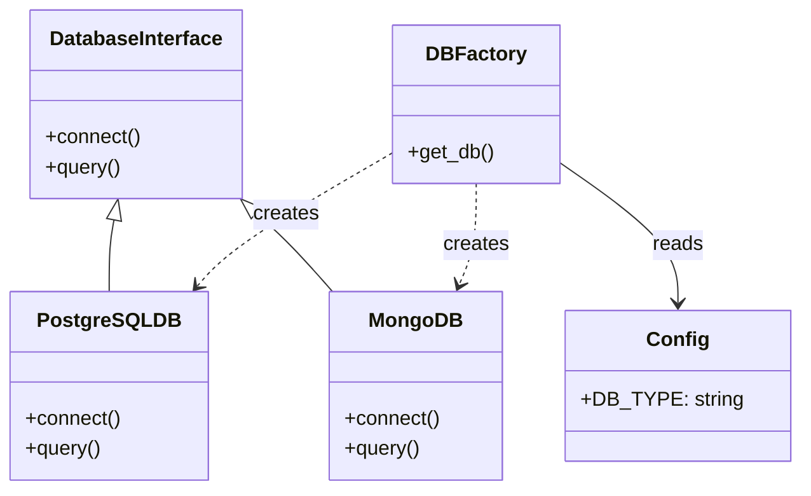
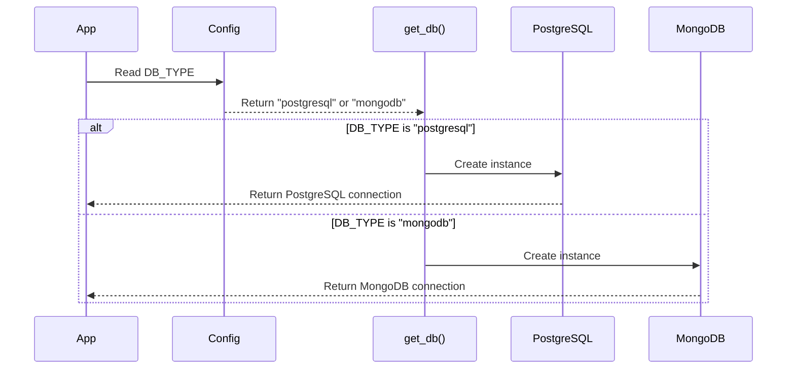
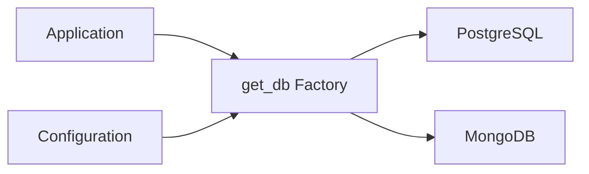
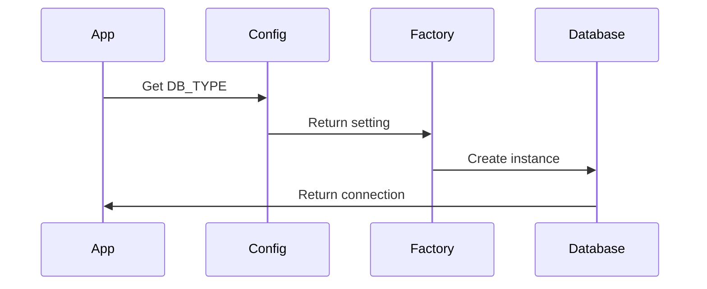
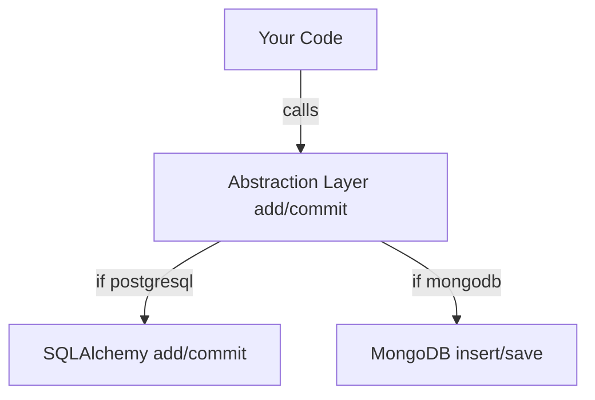

# Facewatch

A facial recognition-based watchlist system that allows you to register faces and verify them against a database.

## Features

- Face Registration: Upload images with associated URLs and reasons
- Face Verification: Check if a face exists in the watchlist
- PostgreSQL Database: Secure storage of face data
- Real-time Face Recognition: Using face_recognition library

## Prerequisites

- Python 3.10 or higher
- Poetry (Python package manager)
- Docker
- Make
- CMake (for dlib compilation)

  ```bash
  # Windows (using chocolatey)
  choco install cmake
  
  # macOS
  brew install cmake
  
  # Ubuntu/Debian
  sudo apt-get install cmake
  ```

## Quick Start

1. Setup the project:

   ```bash
   make setup
   ```

2. Run the application:

   ```bash
   make run
   ```

   The application will be available at <http://localhost:5000>

## Development Commands

| Command | Description |
|---------|-------------|
| `make setup` | First-time setup (install deps + create db + init tables) |
| `make run` | Start the Flask application |
| `make db` | Create PostgreSQL database in Docker |
| `make init-db` | Initialize database tables |
| `make clean-db` | Stop and remove database container |
| `make restart-db` | Reset database (clean slate) |
| `make mongodb` | Create MongoDB container |
| `make clean-mongodb` | Stop and remove MongoDB container |
| `make restart-mongodb` | Reset MongoDB (clean slate) |

---



---



---



---



---


